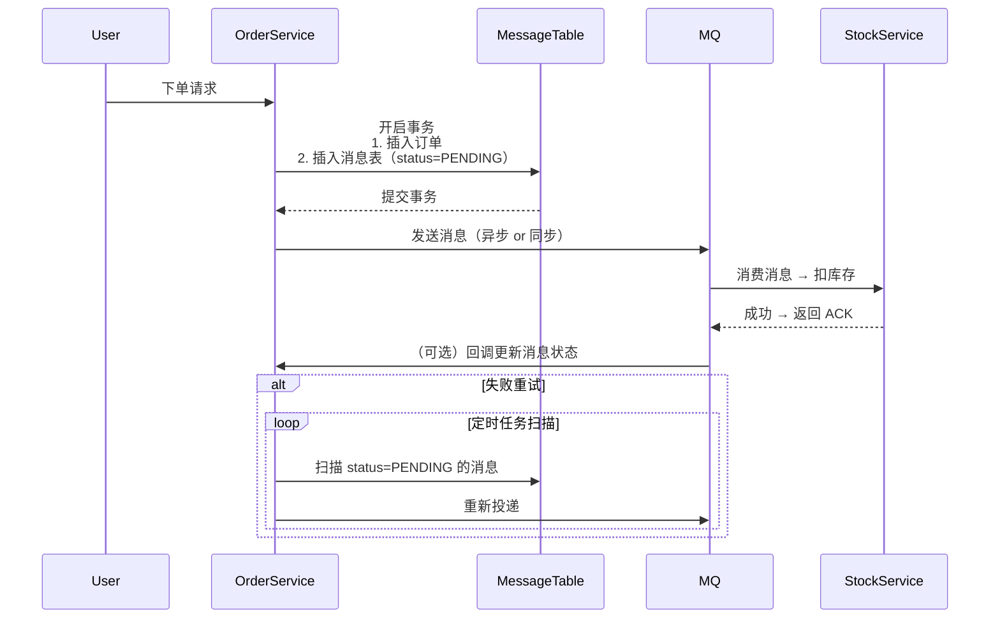

# SpringBoot

### **1.** Spring Boot 自动配置原理是什么？条件注解如何工作？

**核心原理：**

* Spring Boot 通过 `@EnableAutoConfiguration` 触发自动配置。
* 它会扫描 `META-INF/spring/org.springframework.boot.autoconfigure.AutoConfiguration.imports`（Spring Boot 2.7+）或旧版的 `spring.factories` 文件，加载所有 `AutoConfiguration` 类。
* 每个 `AutoConfiguration` 类都使用 **条件注解（Conditional Annotations）** 控制是否生效。

条件注解工作机制：

* 如 `@ConditionalOnClass`：检查 classpath 是否存在某类；
* `@ConditionalOnMissingBean`：只有当容器中没有该 Bean 时才创建；
* `@ConditionalOnProperty`：根据配置属性决定是否加载；
* 底层通过 `ConditionEvaluator` 在 BeanDefinition 注册阶段判断条件是否满足。

> ✅ **关键点**：自动配置是“约定优于配置”的体现，但可通过 `exclude` 或自定义 `@Conditional` 覆盖。

